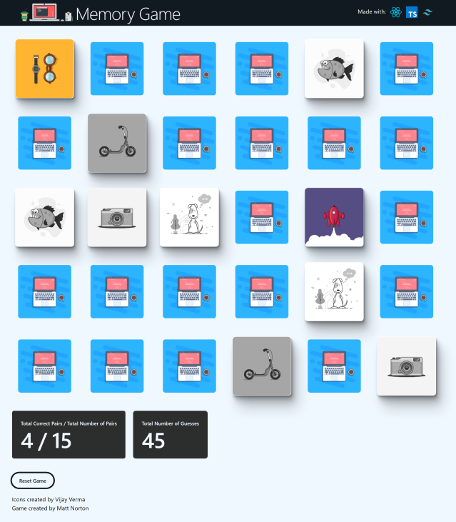

# Memory Game
Created with


🖥️ [Memory Game Demo](https://memory-game-six-rouge.vercel.app/)

[](https://memory-game-six-rouge.vercel.app/)
## Description
I built this app for fun and to practice TailwindCSS. Minor improvements when time allows.


### Getting Started
```
npm install
npm run dev
```
